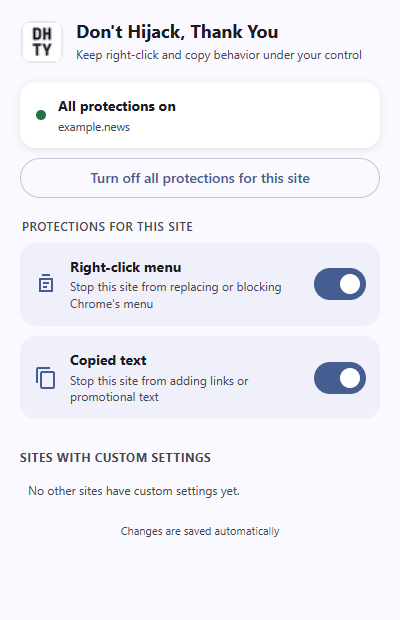

  

<h1 align="center">Don't Hijack, Thank You</h1>

  Keep right-click and copy behavior under your control.

Some websites replace your browser's right-click menu, disable it entirely, or
add links and promotional text when you copy something. **Don't Hijack, Thank
You** is designed to preserve the behavior you expect.

  

  Actual extension popup rendered in Brave. Native context menus retain
  the appearance provided by your browser and operating system.

## What it does

- **Helps preserve your browser's right-click menu** when a website replaces or
  blocks it.
- **Helps preserve copied text** by stopping common clipboard-rewriting
  handlers.
- Provides **independent controls for every website**.
- Lets you turn all protections off for selected sites and revisit previously
  configured sites.

Both protections are enabled by default. You can turn either one off when a
site legitimately needs custom behavior, such as an editor, game, map, or
remote-desktop application.

## Install

### Install from a browser store

The extension has not been published to a browser store yet.

| Browser | Availability |
| --- | --- |
| Chrome | Not yet available in the Chrome Web Store |
| Brave | Not yet available in the Chrome Web Store |
| Edge | Not yet available in Microsoft Edge Add-ons |

Until a store release is available, use the source installation steps below.
The current package targets Chromium browsers. Firefox is not currently
packaged or tested as a supported release.

### Install from source

Use an unpacked installation when developing the extension or testing the
source before it is published.

1. Get the source:
   - Repository:
     <https://github.com/ujjanth-arhan/dont-hijack-thank-you>
   - Release archive:
     <https://github.com/ujjanth-arhan/dont-hijack-thank-you/releases>
   - Or select **Code → Download ZIP** from the repository.
2. Extract the downloaded ZIP if necessary.
3. Open the extensions page for your browser:

   | Browser | Extensions page |
   | --- | --- |
   | Chrome | `chrome://extensions` |
   | Brave | `brave://extensions` |
   | Edge | `edge://extensions` |

4. Turn on **Developer mode**.
5. Select **Load unpacked**.
6. Choose the project folder containing `manifest.json`.
7. Optionally pin **Don't Hijack, Thank You** from the browser's Extensions
   menu.

Unpacked extensions do not update automatically. Reload the extension after
changing its files.

## Use it

There is nothing to start manually. After installation:

1. Reload any tabs that were already open.
2. Right-click or copy text normally.
3. Select the extension icon to change settings for the current website.

The popup lets you:

- Turn right-click protection on or off.
- Turn copied-text protection on or off.
- Turn off every protection for the current site.
- Expand another configured site and adjust each protection individually.
- Remove custom settings to restore the defaults.

Changes are applied immediately and saved automatically.

## Update a developer installation

Published store installations update through the browser. For an unpacked
developer installation:

1. Replace or pull the extension files.
2. Open your browser's extensions page.
3. Select **Reload** on the extension card.
4. Reload affected website tabs.

## Permissions

| Permission | Why it is needed |
| --- | --- |
| Access to all websites | Loads protection at the start of pages where the extension is supported. |
| Storage | Saves per-site feature settings. |

## Known limitations

- Chromium browsers do not allow extensions to modify browser-owned pages,
  extension stores, or some built-in viewers.
- Touch long-press behavior is separate from desktop right-click behavior.
- Protection also runs in embedded content. Content loaded from another
  website follows that website's own settings.
- Blocking website handlers can interfere with legitimate custom menus or copy
  formatting. Disable only the affected feature for that site.

## Reliability

Websites and browsers can change without notice, and no extension can guarantee
that every current or future interception technique will be blocked. This
project is provided as-is, without a guarantee that it will work on every
website or in every browser version.

<strong>Development notes</strong>

No build step or package installation is required.

- `feature-config.js` defines available protections and their defaults.
- `settings-model.js` owns settings defaults, origin rules, migration, and
  storage access.
- `interceptor.js` blocks enabled page event handlers.
- `settings.js` supplies per-origin settings to the interceptor.
- `popup.*` contains the extension interface and site-rule management.

To add a protection, register its user-facing metadata in `feature-config.js`
and implement its page behavior in `interceptor.js`.

Open `tests/test-runner.html` in a Chromium browser to run the dependency-free
behavior tests. The page reports each check as `PASS` or `FAIL`.

